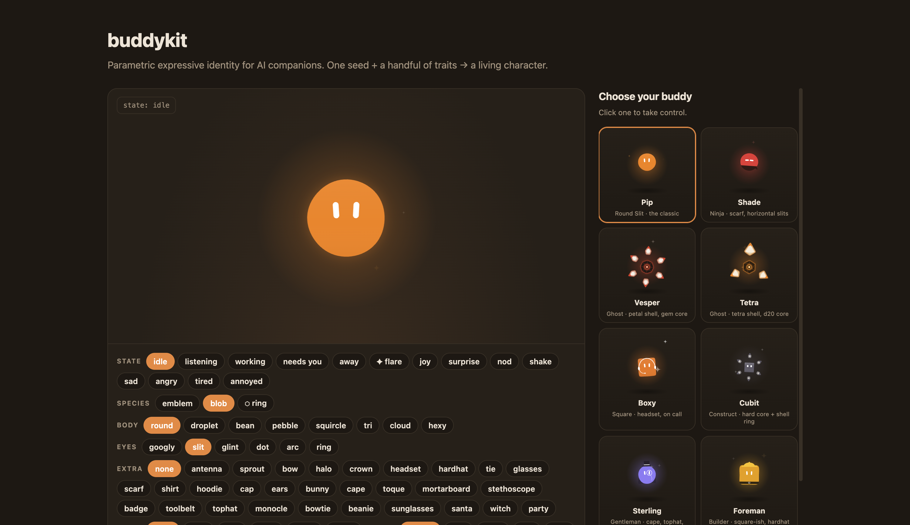

# buddykit



Living 2D characters for AI companions. One seed + a handful of traits → an
animated being with states, emotes, and a wardrobe. Canvas 2D, spring physics,
zero dependencies.

```sh
npm install @metonymous/buddykit
```

```ts
import { mountBuddy } from "@metonymous/buddykit";

const buddy = mountBuddy(canvasEl, {
  species: "blob",        // "emblem" (geometric ghost) | "blob" (soft, two-eyed) | "block" (stacked slabs)
  body: "round", eyes: "googly", theme: "ember",
  build: "stout",         // block species: stout | tall | wide | mini | long
  accessories: ["ears", "bowtie"],
  accessoryColors: { bowtie: "#d6453d" },   // per-accessory color overrides
  hardness: 0,            // 0 soft blob → 1 rigid faceted core
  shell: false,           // orbit the emblem's plate ring around any blob
  seed: 42,               // same seed → same being
});

buddy.setState("working");   // idle | listening | working | needs_you | away
buddy.fire("joy");           // joy | surprise | nod | shake | sad | angry | tired | annoyed
buddy.configure({ theme: "sumi", accessories: ["tophat", "monocle", "cape"] });
const cfg = buddy.getConfig();   // a buddy IS its config — store it, remount it anywhere
buddy.destroy();
```

A buddy is deterministic from its config: `getConfig()` → JSON →
`mountBuddy(canvas, cfg)` reproduces the identical character. `renderPosterPng`
exports a static frame.

Demo: `npm install && npm run dev`.

License: Apache-2.0
